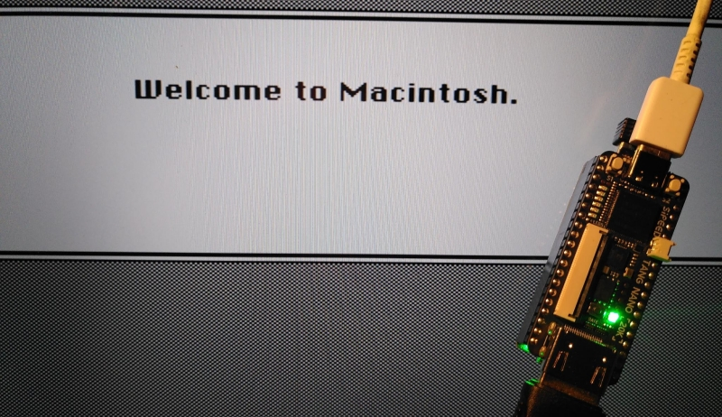

# NanoMac

NanoMac is a port of the [PlusToo](https://www.bigmessowires.com/2012/12/15/plus-too-files/) Apple Macintosh Plus FPGA implementation to the [Tang Nano 20K](https://wiki.sipeed.com/hardware/en/tang/tang-nano-20k/nano-20k.html) FPGA development boards.



This is based on the [MiSTeryNano project](https://github.com/harbaum/MiSTeryNano/) and also relies on a [FPGA companion](http://github.com/harbaum/FPGA-Companion) to be connected to the FPGA board for USB support and on-screen-display control.

This version is based on the [MiSTer port of PlusToo](https://github.com/MiSTer-devel/MacPlus_MiSTer) which in turn
was based on the [MiST port of PlusToo](https://github.com/mist-devel/plus_too). Major changes over these versions have been done to clean-up major parts of the design like video timing, memory access speed, floppy implementation and the like with many more changes to come.

Current state:

  * PlusToo core working
  * ROM stored in flash ROM
  * 128k, 512k, 1M or 4M ram configurable
  * Support for two floppy disk images in DSK format
  * HDMI video using the original 512x342p@60Hz mode
  * Keyboard and Mouse via USB
  * [Fully simulated](sim)

Planned features:
  * Many more code cleanups 
  * Floppy disk write support

## Videos

  * [NanoMac #2: Mac Plus on a tiny FPGA](https://www.youtube.com/watch?v=Lqf23NVxUAg)
  * [NanoMac #1: First boot of Apple Mac Plus on Tang Nano 20k](https://www.youtube.com/shorts/wxhe5facZ5A)

## What's needed?

  * ```nanomac.fs``` needs to be flashed to the FPGA's flash memory
    * ```openFPGALoader -f nanomac.fs```
  * On Nano 20k a mac plus rom (e.g. ```plusrom.bin``` from the original PlusToo archive) needs to be flashed to offset 0x480000
    * ```openFPGALoader --external-flash -o 0x480000 plusrom.bin```
  * The [latest FPGA Companion firmware](http://github.com/harbaum/FPGA-Companion) needs to be flashed to the support MCU
  * At least one disk image in ```DSK``` format (819200 bytes in in size) containing e.g. [System 3.0](https://winworldpc.com/product/mac-os-0-6/system-3x) has to be placed on an SD card
